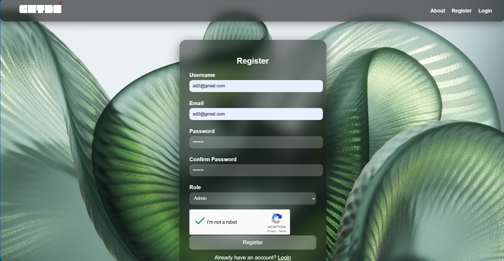
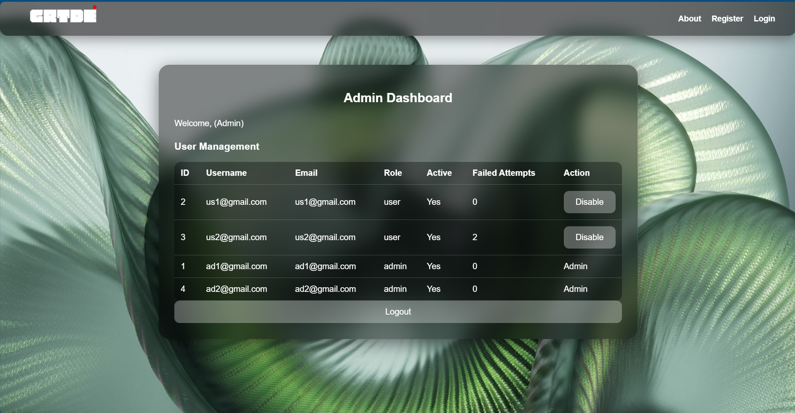
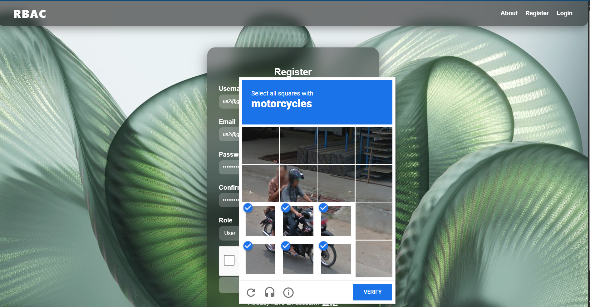
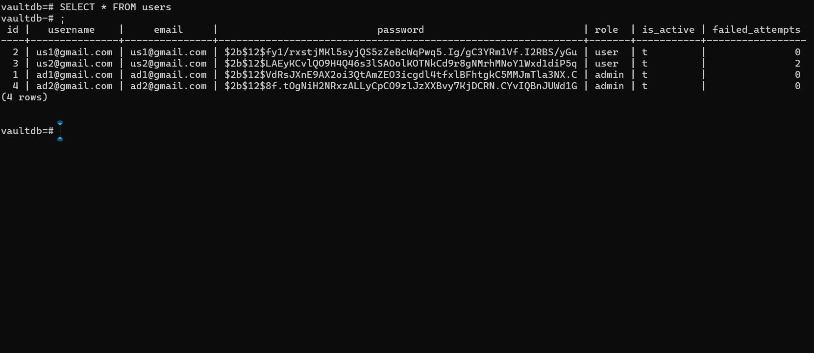

# Secure Login System with RBAC

## Overview
This project is a secure login and registration system built using Flask, PostgreSQL, and JWT authentication.  
It includes **Role-Based Access Control (RBAC)** with separate dashboards for Admin and User roles.  
Security features include input validation, CAPTCHA, and account lockout after failed login attempts.

---

## Features
- User registration with hashed passwords (`bcrypt`)
- User login with JWT session management
- **Role-Based Access Control (RBAC):**
  - Admins can view and manage users
  - Users have access to a personal dashboard
- Account lockout after repeated failed logins
- Google reCAPTCHA to prevent brute-force attacks
- Glassmorphic styled frontend with HTML, CSS, and JavaScript

---

## Screenshots

### Login Page


### Register Page


### User Dashboard


### Admin Dashboard


### About Page


### reCAPTCHA


### Database Schema


---

## Project Structure
```bash
secure-login-system/
│── src/
│   ├── backend/
│   │   ├── app.py
│   │   ├── config.py
│   │   ├── templates/
│   │   │   ├── index.html
│   │   │   ├── register.html
│   │   │   ├── dashboard.html
│   │   │   └── admin_dashboard.html
│   │   ├── static/
│   │   │   ├── style.css
│   │   │   ├── script.js
│   │   │   └── admin_script.js
│── requirements.txt
│── README.md